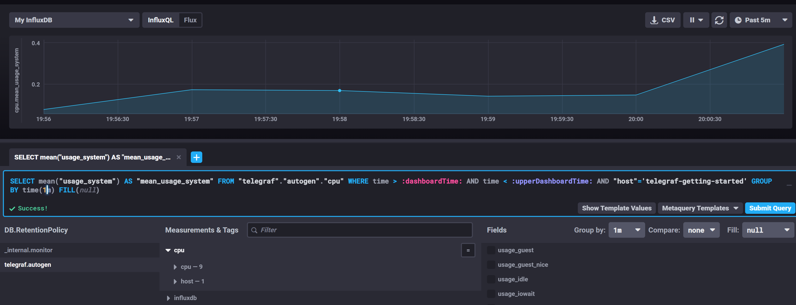

### 1. Минимальный набор метрик для мониторинга проекта
Мне кажется, что нужно отслеживать базовые вещи, которые помогут понять, что происходит с системой. Например:  

**CPU**
  - Нагрузка на проц в процентах.  
  - средняя нагрузка на процессор за разный период времени. 
  - Может быть, стоит смотреть температуру процессора, чтобы не перегревался.

**RAM**:  
  - Сколько памяти занято.  
  - Если памяти не хватает и используется swap, надо понять, как часто к нему обращаются.

**Диск**:  
  - Сколько места занято.
  - Мониторинг inode, если пачками сохраняются мелкие файлы.

**Сеть**:
  - Общая нагрузка на сеть
  - Сколько запросов приходит по HTTP за определенный промежуток времени
  - Какие коды ответа возвращает сервер

### 2. Предложение для менеджера продукта  
Думаю, что эти показатели помогут менеджеру понять, как платформа выполняет свои обязательства перед клиентами:

**SLA/SLI/SLO**:  
  - SLA - доступность сервиса, например, сервис доступен определённое количество времени, например, 99% успешных запросов.  
  - SLI - метрики уровня сервиса, такие как:  
    - Сколько времени уходит на обработку запросов.  
    - Сколько запросов успешные (например, с кодом 2xx).  
    - Сколько времени уходит на вычисления.  
  - SLO - целевые значения, которых мы хотим достичь, например, чтобы успешных запросов было 99.5%.  

**Бизнес-метрики**:  
  - Сколько задач удалось завершить.  
  - Сколько времени в среднем занимает выполнение одной задачи.  
  - Сколько ошибок произошло (если такое возможно отследить).  
  Наверное, это поможет менеджеру понять, как хорошо мы справляемся с работой.

### 3. Решение для логирования при ограниченном бюджете  
Если денег на централизованное логирование нет, то наверное можно сделать что-то простое.  

**Локальные логи**:  
  - Настроить так, чтобы логи периодически удалялись (например, через logrotate).  
  - Хранить логи прямо на серверах.  
  - Дать доступ разработчикам к серверам или придумать, как им отправлять логи.  

**Уведомления об ошибках**:  
  - Настроить алерты в системе мониторинга Prometheus + Alertmanager, чтобы видеть, когда появляются ошибки.

**Отправка логов**:  
  - Сделать скрипт, который ищет ошибки и отправляет уведомления по почте или в мессенджеры, например в телеграм

### 4. Ошибка в SLA вычислениях  

SLA = summ_2xx_requests/summ_all_requests

Если SLA ниже 70%, но при этом ошибок 4xx и 5xx нет, скорее всего есть много запросов, которые возвращают коды 1xx или 3xx. Эти коды не считаются успешными, но включаются в общее число запросов.  
Нужно добавить их в числитель:

SLA = (summ_2xx_requests + summ_1xx_requests + summ_3xx_requests)/summ_all_requests

А так-же будет полезным убедиться, что данные метрик собираются и обрабатываются правильно.  

### 5. Плюсы и минусы Push и Pull

**PUSH**

*Плюсы*
- упрощение репликации данных в разные системы мониторинга или их резервные копии
- более гибкая настройка отправки пакетов данных с метриками
- UDP - это менее затратный способ передачи данных, из-за чего  ожет возрасти производительность сбора метри

*Минусы*
- Сложность конфигурации агентов
- Безопасность. Агенты отправляют данные на сервер, что требует открытых портов и дополнительных механизмов аутентификации и шифрования

**PULL**

*Плюсы*
- легче контролировать подлинность данных
- можно настроить единый proxy server до всех агентов с TLS
- упрощённая отладка получения данных с агентов

*Минусы*
- Зависимость от доступности конечной точки:
Если хост временно недоступен, метрики за этот период будут потеряны
- Сервер мониторинга должен опрашивать множество конечных точек, что увеличивает его нагрузку с ростом числа источников данных

### 6. Push и Pull модели
- Pull: Prometheus, Nagios
- Push: TICK
- Гибридные: Zabbix, VictoriaMetrics

### 7. Окно интерфейса chronograf

### 8. Метрики CPU

FILL 4

1 min

5 min

### 9. Метрики docker

