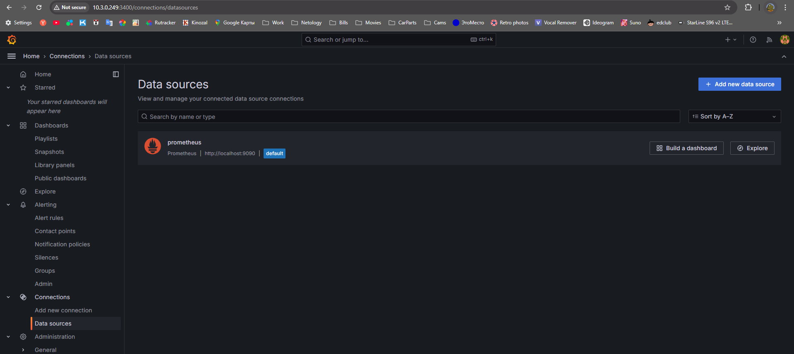
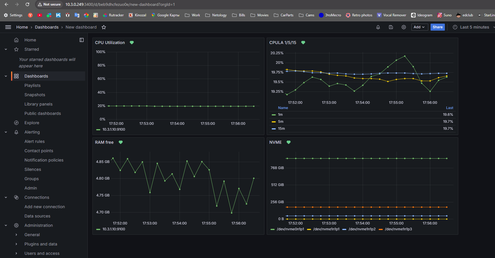

### 1.

Давно разворачиваем графану с прометеусом на отдельной железке ансиблом без докера

Cкриншот веб-интерфейса grafana со списком подключенных Datasource 



### 2.
 
promql-запросы для выдачи метрик:

cpu util: ```100 - (avg(rate(node_cpu_seconds_total{mode="idle", instance="10.3.1.10:9100"}[5m])) by (instance) * 100)```

cpula 1: ```100 - (avg(rate(node_cpu_seconds_total{mode="idle", instance="10.3.1.10:9100"}[1m])) by (instance) * 100)```

cpula 5: ```100 - (avg(rate(node_cpu_seconds_total{mode="idle", instance="10.3.1.10:9100"}[5m])) by (instance) * 100)```

cpula 15: ```100 - (avg(rate(node_cpu_seconds_total{mode="idle", instance="10.3.1.10:9100"}[15m])) by (instance) * 100)```

ram: ```node_memory_MemFree_bytes{instance="10.3.1.10:9100"}```

size disks: ```node_filesystem_size_bytes{fstype!="tmpfs",fstype!="fuse.lxcfs", instance="10.3.1.10:9100"}```

### 3.

Cкриншот Dashboard



### 4.

[Dashboard файл json](panel.json)